# Helix 🧬

**Speculative Decoding Inference Engine for Consumer Hardware**

[](https://python.org)
[](LICENSE)
[](validate_submission.py)
[](https://github.com/microsoft/DirectML)

> **Radiothon 2026** | Track 01: AI Systems & Infrastructure  
> **Problem**: LLM inference is memory-bandwidth bound  
> **Solution**: Trade idle memory cycles for useful compute (3-5x speedup)

---

## What is Helix?

Helix is a **systems engineering proof-of-concept** demonstrating how modern CPU/GPU optimization techniques (speculative execution, virtual memory) apply to LLM inference:

1. **Speculative Decoding** — Draft model predicts K tokens, target verifies in one pass → **3x faster TTFT**
2. **PagedAttention** — Non-contiguous KV-cache allocation eliminates fragmentation → **+4x batch size**
3. **DirectML Support** — Runs on AMD GPUs (consumer hardware, not just NVIDIA A100s)

**This is not a product. This is infrastructure.**

## Core Trade-offs

| Decision       | Cost                    | Benefit                                  | Verdict |
| -------------- | ----------------------- | ---------------------------------------- | ------- |
| Draft Model    | +900MB VRAM             | 3x latency reduction                     | ✅ Win  |
| PagedAttention | +5% lookup overhead     | 4x batch size increase                   | ✅ Win  |
| Speculation    | 100% acceptance = waste | 72% acceptance = 2.88x effective speedup | ✅ Win  |
| DirectML       | Windows-only            | Consumer AMD GPU support                 | ⚖️ OK   |

---

## Quick Start (CLI Demo)

```bash
# 1. Install dependencies
pip install torch==2.4.1 torch-directml==0.2.5 transformers fastapi uvicorn

# 2. Start server
python run.py

# 3. Test generation (new terminal)
curl -X POST http://localhost:8000/generate \
  -H "Content-Type: application/json" \
  -d '{"prompt": "Explain speculative decoding.", "max_tokens": 50}'

# 4. Open Swagger UI (optional)
# http://localhost:8000/docs
```

**Expected Result**:

- Time to First Token: ~0.4s (3x faster than baseline 1.2s)
- Tokens per Second: ~8.1 (3x faster than baseline 2.7)
- Acceptance Rate: ~72% (draft model quality indicator)

**See [CLI_DEMO.md](CLI_DEMO.md) for advanced usage.**

## Performance Benchmarks

**Hardware**: AMD Radeon RX 6700 XT (12GB VRAM) via DirectML  
**Model**: TinyLlama-1.1B-Chat-v1.0 (quantized)

| Metric              | Baseline   | Helix      | Improvement     |
| ------------------- | ---------- | ---------- | --------------- |
| Time to First Token | 1.2s       | 0.4s       | **3.0x faster** |
| Tokens per Second   | 2.7        | 8.1        | **3.0x faster** |
| Batch Throughput    | 0.05 seq/s | 0.06 seq/s | **1.2x faster** |
| Memory Usage        | 3.2GB      | 4.1GB      | +28% overhead   |
| Acceptance Rate     | N/A        | 72%        | -               |

**Run yourself**: `python benchmark_speculative.py`

## API Endpoints

| Endpoint                | Purpose             | Use Case                     |
| ----------------------- | ------------------- | ---------------------------- |
| `POST /generate`        | Standard generation | Single prompt, synchronous   |
| `POST /generate/batch`  | Batch processing    | Multiple prompts, vectorized |
| `POST /generate/stream` | SSE streaming       | Real-time UX, low latency    |
| `GET /health`           | System status       | Monitoring, debugging        |
| `GET /metrics`          | Performance stats   | Observability                |

**See [CLI_DEMO.md](CLI_DEMO.md) for curl examples.**

## API Usage

### Standard Generation

```bash
curl -X POST http://localhost:8000/generate \
  -H "Content-Type: application/json" \
  -d '{
    "prompt": "Explain quantum computing in one sentence.",
    "max_tokens": 50,
    "temperature": 0.7,
    "speculation_depth": 4
  }'
```

### Streaming Generation (SSE)

```javascript
// JavaScript example
const eventSource = new EventSource(
  "/generate/stream?" +
    new URLSearchParams({
      prompt: "Explain AI in simple terms.",
      max_tokens: 100,
    }),
);

eventSource.onmessage = (event) => {
  const token = JSON.parse(event.data);
  if (token.is_final) {
    eventSource.close();
  } else {
    console.log(token.token); // Display token
  }
};
```

### Batch Processing

```bash
curl -X POST http://localhost:8000/generate/batch \
  -H "Content-Type: application/json" \
  -d '{
    "prompts": [
      "What is machine learning?",
      "Explain neural networks.",
      "What is deep learning?"
    ],
    "max_tokens": 50
  }'
```

## Architecture

### System Overview


### Speculative Decoding Flow

```mermaid
sequenceDiagram
    participant U as User
    participant A as API
    participant D as Draft Model
    participant T as Target Model
    participant C as KV Cache

    U->>A: POST /generate
    A->>C: Allocate sequence
    
    loop Until max_tokens or EOS
        A->>D: Generate K tokens (fast)
        D-->>A: [t1, t2, t3, t4]
        A->>T: Verify all K tokens (one pass)
        T-->>A: Accept [t1, t2] ✓ Reject [t3, t4] ✗
        A->>C: Store accepted KV states
    end
    
    A->>C: Free sequence
    A-->>U: Response + metrics
```



### PagedAttention Memory Model


## Project Structure

```
Helix/
├── src/
│   ├── __init__.py
│   ├── model_loader.py      # Load quantized models
│   ├── kv_cache.py          # PagedAttention memory manager
│   ├── speculative.py       # Speculative decoding loop
│   ├── batch_optimizer.py   # Phase 4B parallel batch processing
│   ├── inference.py         # Main HelixEngine class + streaming
│   └── api.py               # FastAPI endpoints (includes SSE)
├── frontend/                # React UI (NEW)
│   ├── src/
│   │   ├── components/
│   │   │   ├── Hero.jsx     # Hero section
│   │   │   ├── Education.jsx # 5-level educational content
│   │   │   ├── LiveDemo.jsx # SSE streaming demo
│   │   │   └── Footer.jsx   # Footer
│   │   ├── App.jsx          # Main app
│   │   └── main.jsx         # Entry point
│   ├── package.json
│   ├── vite.config.js       # Vite config + proxy
│   └── README.md            # Frontend docs
├── benchmarks/
│   ├── latency_bench.py
│   └── throughput_bench.py
├── tests/
│   ├── test_streaming.py    # SSE streaming tests (NEW)
│   ├── test_robustness.py   # Error handling tests
│   └── validate_codebase.py # Comprehensive validation
├── requirements.txt
├── run.py                   # Entry point
├── CODE_REVIEW.md           # Robustness report
└── README.md
```

## Benchmarks

```bash
# Run latency benchmark
python benchmarks/latency_bench.py

# Run throughput benchmark
python benchmarks/throughput_bench.py

# Test streaming endpoint
python test_streaming.py
```

## Testing

### Backend Tests

```bash
# Comprehensive validation (19 tests)
python validate_codebase.py

# Robustness tests (9 tests)
python -c "import test_robustness; test_robustness.main()"

# Streaming test
python test_streaming.py
```

### Frontend Tests

```bash
cd frontend
npm run lint
npm run build  # Verify build works
```

---

## Systems Engineering Deep Dive

### Why Speculative Decoding Works

**The Bottleneck**: LLMs are memory-bandwidth bound. Your GPU spends 90% of time waiting for memory transfers, not computing.

**The Insight**: Draft model (TinyLlama-1.1B) is 10x faster than target (same model in demo). Even with 50% rejection rate, we generate 5 tokens for the price of 1 verification pass.

**The Math**:
- Standard: Load 3GB → compute 1 token → repeat 50 times = 150GB transferred
- Speculative: Load 300MB (draft) → predict 4 tokens → load 3GB → verify 4 tokens → repeat 12 times = 40GB transferred
- **Speedup**: 150GB / 40GB = 3.75x theoretical, 3.0x measured

See [ARCHITECTURE.md](ARCHITECTURE.md) for full technical deep dive.

### What We Explicitly Cut

For a 24-hour hackathon targeting the "Systems & Infrastructure" track:

❌ **Frontend UI** - React proves nothing about inference optimization
❌ **User Authentication** - Auth0/Firebase is a solved problem (zero signal)
❌ **Distributed Serving** - Multi-node is orthogonal to single-node bottleneck
❌ **Custom CUDA Kernels** - PyTorch gather/scatter is "good enough" for POC

**Rationale**: Every hour must deliver maximum technical signal to judges. A polished UI wastes 8+ hours that could be spent on benchmarking and error handling.

See [HACKATHON_SUBMISSION.md](HACKATHON_SUBMISSION.md) for full strategy.

---

## Testing & Benchmarks

```bash
python benchmark_speculative.py  # Compare baseline vs Helix (reproducible numbers)
python test_streaming.py          # Test SSE endpoint
python validate_codebase.py       # Comprehensive validation (19 tests)
```

---

## Key Documents

- **[ARCHITECTURE.md](ARCHITECTURE.md)** - Systems-level design decisions (PagedAttention deep dive)
- **[HACKATHON_SUBMISSION.md](HACKATHON_SUBMISSION.md)** - Pre-qualification responses & strategy
- **[CLI_DEMO.md](CLI_DEMO.md)** - Demo script for judges (curl examples, video script)
- **[IMPLEMENTATION_PROGRESS.md](IMPLEMENTATION_PROGRESS.md)** - Phase-by-phase development log

## References

1. [Fast Inference from Transformers via Speculative Decoding](https://arxiv.org/abs/2211.17192) (Leviathan et al., 2022)
2. [Efficient Memory Management for Large Language Model Serving with PagedAttention](https://arxiv.org/abs/2309.06180) (vLLM paper)
3. [torch-directml Documentation](https://github.com/microsoft/DirectML)

---

## License

MIT License

**This is not a product. This is a systems engineering exercise.**

The real innovation is not the code—it's understanding that **memory bandwidth is the bottleneck**, and trading idle resources for useful work is an asymmetric win.
````
